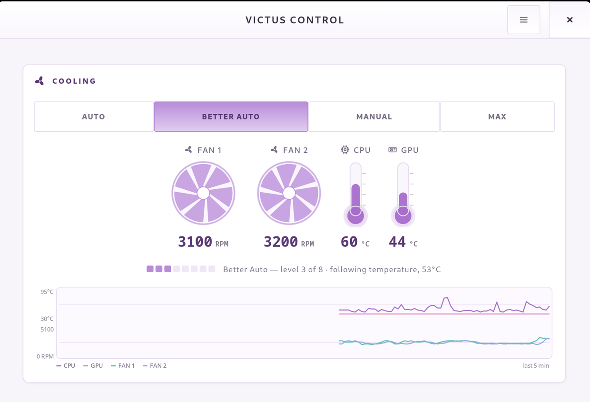

<div align="center">


# victus-control

**Fan control and keyboard lighting for HP Victus / Omen laptops on Linux.**

Stock firmware parks both fans near **2000 RPM** in AUTO while the CPU cooks.
`victus-control` gives you a real fan curve, animated RGB backlighting, a
privileged backend, a GTK4 desktop app, and a GNOME Shell extension.

<br>

[](LICENSE)
[](#system-requirements)
[](https://www.gtk.org/)
[](#contributing)

[](#install--update)
[](#fedora-notes)
[](#ubuntu--debian-notes)
[](#gnome-shell-extension)

</div>

---

> **This is a fork of [Batuhan4/victus-control](https://github.com/Batuhan4/victus-control).**
> It adds support for the Victus 15-fa1xxx (DMI board `8BC8`) and a set of fan
> control and interface fixes found by measuring on that machine. See
> [About this fork](#about-this-fork).

---

<div align="center">


*One page: animated backlight preview above, analog fan dials and thermometers below.*

</div>

---

## Contents

- [About this fork](#about-this-fork)
- [Why victus-control](#why-victus-control)
- [Quick install](#quick-install)
- [Support matrix](#support-matrix)
- [Secure Boot / userspace alternative](#secure-boot--userspace-alternative)
- [System requirements](#system-requirements)
- [Install & update](#install--update)
- [Daily usage](#daily-usage)
- [Lighting effects](#lighting-effects)
- [GNOME Shell extension](#gnome-shell-extension)
- [Developing](#developing)
- [Troubleshooting](#troubleshooting)
- [Contributing](#contributing)
- [License](#license)

---

## About this fork

Upstream is [Batuhan4/victus-control](https://github.com/Batuhan4/victus-control),
and everything it does still works here. This fork is maintained for a **Victus
by HP Gaming Laptop 15-fa1xxx** — DMI board `8BC8`, Intel Core i5-13420H,
RTX 3050, Fedora — and adds what follows. All of it was found by measuring on
that machine rather than by reading code, so the numbers below are real
readings.

<div align="center">



</div>

### The board

`8BC8` is missing from the `hp-wmi` driver's board table, in mainline and in the
out-of-tree DKMS module alike, even though its neighbours `8BC2`, `8BCA` and
`8BCD` are listed. The firmware compounds it by reporting that the machine has
no software fan support — `HPWMI_GET_SYSTEM_DESIGN_DATA` byte 4 reads 0 — which
is simply untrue: the EC accepts manual targets and both fans reach them
exactly. Listing the board is all it takes, and
[`board-8bc8/`](board-8bc8/) carries both ways of doing that: a four-line patch
for mainline, and a DKMS package that builds the stock driver of your kernel
series with the entry added. Read its notes first — the stock driver exposes a
different hwmon interface, so it is not a drop-in swap for the module this
project installs.

### Better Auto judges heat, not spikes

The CPU package sensor swings from 44 °C to 86 °C and back inside a second
whenever a single core takes a turbo burst. Measured here at 50 ms resolution,
with one core busy for 1.5 s:

```
t=2.51s  44 C
t=2.76s  86 C     <- one core boosting
t=3.51s  86 C
t=3.77s  47 C
```

That is a real silicon reading, but it is a die hotspot with almost no energy
behind it — the heatsink never feels it. Deciding on one such sample sent the
fans to maximum at 3 % CPU load, and since the level walked back down one step
per apply, a 2 s spike cost about 90 s of full-speed noise. Better Auto now
decides on the median of the last three samples, climbs at most two steps at a
time, keeps CPU/GPU load from reaching the top of the curve on its own, and
holds a level until the temperature drops clear of the threshold it climbed
through, so an idle machine sitting on a boundary no longer swings the fans
±540 RPM every few seconds. Genuinely sustained heat still goes straight to
maximum.

### Fan control fixes

- **MAX did nothing.** Writing `pwm1_enable=0` asks the EC for maximum but
  leaves any manual fan targets in place, and those win: measured 2400 RPM with
  targets still set against 5100 RPM once released. Only the AUTO path runs the
  driver's `fan_speed_max_reset`, so MAX now passes through it first.
- **The real ceiling is 5100 RPM, not 5800/6100.** `fanN_max` reads 0 on this
  board because the EC's fan table query returns zeroes at module init, so the
  curve was spread over RPM that do not exist and the top levels collapsed into
  each other. Both fans were measured under MAX instead.
- **Fan 2 lagged.** `hp_wmi_set_fan_speed()` re-reads the other fan's *measured*
  speed and re-sends it as that fan's target, so touching fan 2 while fan 1 is
  still ramping pins fan 1 mid-ramp. The fixed ten-second gap that avoided this
  is now a cap: it waits for fan 1 to actually arrive. A one-level change went
  from 10 s to 2.3 s. The manual slider also used to *cancel* the pending fan 2
  write on every new request, which left fan 2 stuck at an old speed while fan 1
  followed every step; it now coalesces to the newest value instead.

### Interface

A light mauve theme in place of the dark one, with the palette shared between
the GTK stylesheet and the cairo gauges so a retheme is one file. The cooling
profile is four linked toggles rather than a dropdown — which also fixed a bug
where simply opening the window knocked the machine out of Better Auto, because
grouping the toggles made GTK activate the first one and that reached the
backend as a real mode change. Added a five-minute rolling plot of temperatures
and fan speeds, a segment meter showing the Better Auto level with the reason
behind it, and an icon set drawn in-app instead of borrowing whichever symbolic
icons the desktop ships (a fan was previously drawn with a *weather* glyph).

### Monitor

The sustained-temperature alerts only reset their streak once the temperature
fell a full 5 °C below the threshold, so a turbo spike started the clock,
readings in between kept it running, and the next spike some seconds later fired
an alert claiming the CPU had been above 90 °C the whole time. It never had. The
streak now breaks on any reading below the threshold. The 85 °C and 90 °C CPU
alerts were dropped as well: Tjmax here is 100 °C and this chip is built to sit
in the 80s under load, so they fired during ordinary gaming and compiling.

---

Anything here that is not specific to board `8BC8` is welcome back upstream.

---

## Why victus-control

| | Feature | What it does |
| :-: | --- | --- |
| 🌀 | **Better Auto** | Samples CPU/GPU temperature and utilisation every ~2 s, clamps to each fan's hardware maximum, and reapplies targets every 90 s with the firmware-required 10 s stagger. Fans climb smoothly with load instead of idling at 2000 RPM like HP's AUTO. |
| 🎚️ | **Manual mode** | Eight RPM steps (~2000 ➜ 5800/6100 RPM) with per-fan precision and watchdog refreshes that keep settings alive through firmware quirks. |
| 🌈 | **Animated lighting** | Single-zone and four-zone RGB, brightness, and rainbow / breathe / flow animations that keep running after the app is closed. |
| 📊 | **Analog telemetry** | Fan dials whose blades turn with the real RPM, and thermometers that shift colour as they heat. |
| 🖥️ | **GNOME integration** | Fan and keyboard controls from the top panel. |

> [!WARNING]
> Validated primarily on **HP Victus 16-s00xxxx** and contributor-tested on the Fedora/Arch variants listed in PRs and issues. Other models may work but are not guaranteed — **monitor your thermals**. On **HP Victus 15 fa0xxx**, manual fan speeds appear unsupported; only `MAX`, `AUTO`, and Better Auto are known to behave.

---

## Quick install

```bash
curl -fsSL https://raw.githubusercontent.com/Batuhan4/victus-control/main/bootstrap.sh | bash
```

The bootstrap script downloads the current `main` branch into a temporary directory and runs `install.sh`.

> [!CAUTION]
> Do **not** pipe this into `sudo`. `install.sh` elevates itself and needs to know the original desktop user to set up the GNOME extension.

---

## Support matrix

| Component | Status |
| --- | --- |
| **Main installer** | Arch-based, Fedora, and Ubuntu/Debian-based distros |
| **Desktop app** | GTK4, installed by the main project installer |
| **GNOME Shell extension** | GNOME Shell 45+, auto-installed by `install.sh` when GNOME is present |
| **Ubuntu / Debian** | Contributor-tested on Ubuntu 24.04 LTS (GNOME 46); other Debian-based distros use the same path but are less tested |

---

## Secure Boot / userspace alternative

If you can't load the patched `hp-wmi` DKMS module — most notably on **Ubuntu with Secure Boot enabled**, where unsigned out-of-tree modules are rejected — see [`victus-fan/`](victus-fan/).

It is a self-contained **userspace** controller that drives the **stock** in-tree `hp-wmi` driver (two-state `pwm1_enable`, no kernel module), tying fan speed to your power profile and CPU / iGPU / NVIDIA temperature via a small daemon + CLI (no GUI). Tested on an HP Victus 15-fb0xxx running Ubuntu 26.04 — see [`victus-fan/README.md`](victus-fan/README.md).

> [!IMPORTANT]
> **Pick one fan controller, not both.** `victus-fan` and the main `victus-backend` both write the same `pwm1_enable` knob; running both at once makes them fight over the fans. Use `victus-fan` **instead of** the DKMS stack on machines where the patched module can't load — not alongside it.

---

## System requirements

| Requirement | Detail |
| --- | --- |
| OS | 64-bit Linux with `systemd` |
| Package manager | `pacman` (Arch), `dnf` (Fedora), or `apt-get` (Ubuntu/Debian) |
| Desktop | GNOME Shell 45+ for the panel extension (optional) |
| Privileges | Root, for the DKMS module, sudoers rules, and systemd units |

---

## Install & update

### Bootstrap one-liner

```bash
curl -fsSL https://raw.githubusercontent.com/Batuhan4/victus-control/main/bootstrap.sh | bash
```

Use this if you want a temporary checkout and the shortest install path.

### Git clone installer

```bash
git clone https://github.com/Batuhan4/victus-control.git
cd victus-control
sudo ./install.sh
```

The wrapper routes to `arch-install.sh`, `fedora-install.sh`, or `ubuntu-install.sh` based on your OS. On GNOME systems it also installs the panel extension for the desktop user automatically.

The installer handles dependency install, user/group creation, DKMS module registration, build + install, and restarts `victus-backend.service`.

> [!NOTE]
> Log out and back in afterwards so your user joins the `victus` group.

### Fedora notes

- Validated by contributors on `HP Victus 16-S0046NT` with Fedora 43.
- The Fedora installer verifies that the patched `hp_wmi` module is actually active before starting the backend.
- If you recently updated the kernel, reboot first so the running kernel matches the installed `kernel-devel` package.

### Ubuntu / Debian notes

- Contributor-tested on Ubuntu 24.04 LTS (GNOME 46) with an HP Victus 16.
- The installer accepts DKMS-managed `hp_wmi` module layouts used by both `/extra` and `/updates/dkms`.
- Secure Boot can block the DKMS module from loading. If install succeeds but `hp_wmi` still does not load, enroll the MOK key with `sudo mokutil --import /var/lib/shim-signed/mok/MOK.der` or disable Secure Boot, then reboot.

### Background services

| Unit | Role |
| --- | --- |
| `victus-healthcheck.service` | Runs at boot to ensure the patched `hp-wmi` DKMS module is built for the current kernel and `hp_wmi` is loaded before the backend starts |
| `victus-backend.service` | Starts at boot and stays active, keeping Better Auto and the lighting applied even with no UI client connected |

---

## Daily usage

Launch the GTK app (`victus-control`) or use the CLI client (`test_backend.py`).

Everything lives on one page, with a card per subsystem.

**Cooling card** — the profile dropdown offers `AUTO`, `Better Auto`, `MANUAL`, `MAX`:

- *Better Auto* is enforced by the background service on each boot, keeps fans in manual PWM, and adjusts RPM from temperature and utilisation — ideal for gaming or heavy workloads.
- *Manual* maps slider positions to calibrated RPM steps; fan 2 honours the 10 s offset automatically.

Fan speed and temperature are shown as analog dials with the digital value under each. The rotor blades turn at a rate derived from the measured RPM, and a stopped fan renders grey rather than merely still. Thermometers and readouts shift cyan → amber → red, crossing at 70 °C and 85 °C.

> [!NOTE]
> On boards whose firmware exposes no fan speed targets, manual speed is removed from the card entirely and both `MANUAL` and `Better Auto` are dropped from the profile list, since both steer the fans through those targets. `AUTO` and `MAX` remain, and the backend leaves such boards on the firmware curve at start-up.

**Keyboard card** — a switch turns the backlight on and off, a row of style radios picks the lighting mode, and the speed slider or colour picker appears depending on which style is selected. There is no Apply step; changing anything applies it.

Backend status: `systemctl status victus-backend.service` (logs via `journalctl -u victus-backend`).

---

## Lighting effects

| Effect | Behaviour |
| --- | --- |
| **Static colour** | One fixed colour — the classic behaviour |
| **Rainbow cycle** | The whole keyboard walks the hue wheel |
| **Breathe** | The current colour fades in and out |
| **Flow (river)** | On four-zone Omen keyboards the hue travels left-to-right across the zones, so the colour flows along the board. Not offered on single-zone hardware, which has no geometry for it |

<div align="center">

<br>
<em>Picking <b>Solid</b> swaps the speed slider for a colour picker — the card only shows the control that applies.</em>
</div>

- The **Speed** slider (1–100) sets the cycle rate.
- Picking a static colour stops the animation. Whichever you chose last, an effect or a solid colour, is restored after a reboot.
- The animation runs in the backend, so lighting keeps going after the GUI is closed. It pauses while the backlight is switched off and resumes when it is switched back on.

> [!TIP]
> Controls that cannot do anything are not shown: **Flow** is absent on single-zone boards, the colour picker only appears for **Solid**, and the speed slider only for the animated styles.

---

## GNOME Shell extension

Quick access to fan and keyboard controls from the top panel.

| | Feature |
| :-: | --- |
| 🌀 | **Fan mode control** — AUTO, Better Auto, MANUAL, MAX |
| 📊 | **Manual fan speed** — per-fan sliders with 8 RPM steps (visible in MANUAL mode) |
| ⌨️ | **Keyboard RGB** — 10 colour presets and a brightness slider |
| 🌡️ | **Live status** — real-time CPU temperature and fan RPM |

```bash
sudo ./install.sh
gnome-extensions enable victus-control@victus
```

`install.sh` installs the extension automatically on GNOME systems. You only need the manual `gnome-extensions enable ...` step after install or after logging back in.

<details>
<summary>Install the extension by itself</summary>

```bash
cd gnome-extension
bash ./install.sh
gnome-extensions enable victus-control@victus
```

</details>

**Requirements:** GNOME Shell 45+, `victus-backend.service` running. On Ubuntu GNOME and other GNOME desktops the extension can be installed separately as long as the backend socket is available.

See [gnome-extension/README.md](gnome-extension/README.md) for detailed documentation.

---

## Developing

```bash
meson setup build --prefix=/usr
meson compile -C build
sudo meson install -C build
```

- Smoke test (requires the backend running): `python test_backend.py`
- The installer fetches `hp-wmi-fan-and-backlight-control`; it is git-ignored to keep the repo lean.

---

## Troubleshooting

<details>
<summary><b>Fans ignore commands</b></summary>

Ensure the DKMS module is loaded:

```bash
dkms status | grep hp-wmi-fan-and-backlight-control
modprobe --show-depends hp_wmi | tail -n1
```

The last command should point at the DKMS-built `hp-wmi.ko` under `/updates/dkms/` on Arch or `/extra/` on other distros.

</details>

<details>
<summary><b>Fans stuck at one speed after the service starts</b></summary>

A few boards report software fan support but have a BIOS that ignores per-RPM targets. Better Auto then switches the fans to MANUAL and cannot steer them, leaving them pinned with the firmware curve disabled.

Check with the backend in Better Auto and the machine under load:

```bash
grep . /sys/devices/platform/hp-wmi/hwmon/hwmon*/fan*_input
journalctl -u victus-backend -n 20
```

If the RPM readings sit at one value while the `better-auto:` lines in the log keep raising the level, your board is affected. Keep the keyboard lighting and leave the fans to the firmware:

```bash
sudo mkdir -p /etc/systemd/system/victus-backend.service.d
printf '[Service]\nEnvironment=VICTUS_NO_FAN_CONTROL=1\n' | \
  sudo tee /etc/systemd/system/victus-backend.service.d/no-fan-control.conf
sudo systemctl daemon-reload && sudo systemctl restart victus-backend
```

With that set the backend puts the driver back into AUTO on every start, refuses fan commands from any client, and the app's cooling card shows fan speeds and temperatures only.

</details>

<details>
<summary><b>Permission errors</b></summary>

Confirm `victus` group membership, then re-run the installer:

```bash
groups $USER
sudo usermod -aG victus $USER
```

Log out and back in for the group change to take effect.

</details>

<details>
<summary><b>Socket missing</b></summary>

```bash
sudo systemd-tmpfiles --create
sudo systemctl restart victus-backend.service
```

</details>

<details>
<summary><b>GNOME extension missing after install</b></summary>

Log out and back in once, then:

```bash
gnome-extensions enable victus-control@victus
```

</details>

<details>
<summary><b>Uninstall</b></summary>

```bash
sudo systemctl disable --now victus-backend
sudo dkms remove hp-wmi-fan-and-backlight-control/$(dkms status -m hp-wmi-fan-and-backlight-control | sed -n 's#.*/\([^,]*\),.*#\1#p' | head -n1) --all
```

Substitute the version shown by `dkms status` if the command above does not resolve it.

</details>

---

## Contributing

See `AGENTS.md` for coding style, testing, and PR expectations. Hardware validation notes are very welcome in PR descriptions — this project lives on contributors reporting what does and does not work on their board.

## License

GPLv3. See [`LICENSE`](LICENSE) for the full text.
